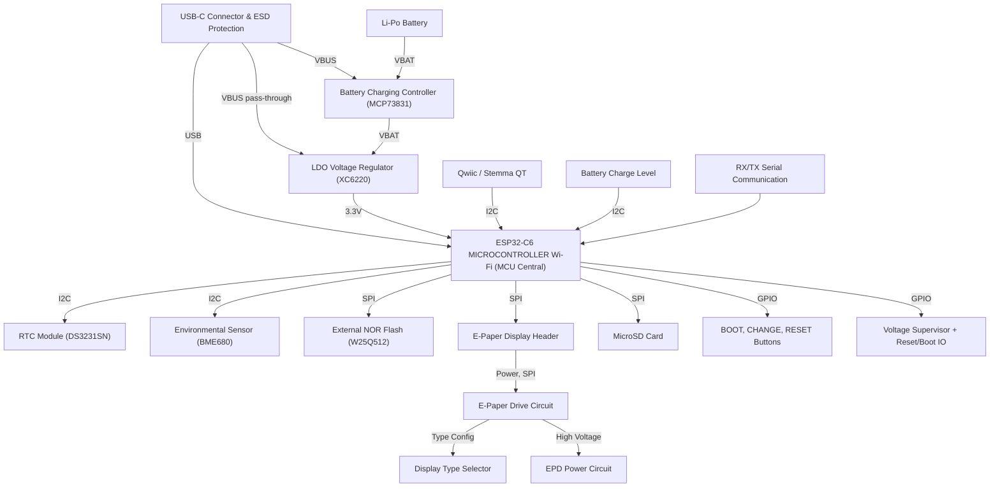

## Aliu Maria-Denisa
#### 335CC
  

## Descriere generală
Acest proiect reprezintă un eBook Reader minimalist, denumit **OpenBook**, construit pe baza platformei **ESP32-C6** și echipat cu un ecran e-paper de **7.5 inch**, o baterie Li-Po, încărcare prin USB-C și butoane fizice pentru control.

Dispozitivul este proiectat să fie eficient energetic și ușor de utilizat, având o interfață simplă controlată prin GPIO-uri, cu funcții de afișare a textelor pentru o experiență de e-reading optimă.

---

## Diagramă Bloc

## BOM (Bill Of Materials)

| Componentă      | Proptietăți                 | Package                                | Link Purchase              | Datasheet                | 
|----------------|-------------------------|----------------------------------------|-----------------------------------|-----------------------------|
| BOOT_BUTTON    | BUTTON_CUSYOMV1         | MYBUTTON | https://industry.panasonic.com/global/en/products/control/switch/light-touch/number/evqpuj02k | https://www.es.co.th/Schemetic/PDF/EVQPUX02K.PDF|
| C1            | 100nF                  | ESP32_WROVER_EAGLE-LTSPICE_C0402       | https://componentsearchengine.com/part-view/CC0402MRX5R5BB106/YAGEO | https://www.farnell.com/datasheets/2167237.pdf|
| C10            | 100nF                  | ESP32_WROVER_EAGLE-LTSPICE_C0402       | https://componentsearchengine.com/part-view/CC0402MRX5R5BB106/YAGEO | https://www.farnell.com/datasheets/2167237.pdf|
| C10_SUPERCAP   | CPH3225A               | CAPCP3225X100N  | https://www.snapeda.com/parts/CPH3225A/Seiko+Instruments/view-part/?ref=eda | https://www.eaton.com/content/dam/eaton/products/electronic-components/resources/data-sheet/eaton-xt-supercapacitors-cylindrical-cells-data-sheet.pdf|
| C1_BAT         | 4.7uF                  | ESP32_WROVER_EAGLE-LTSPICE_C0402       | https://componentsearchengine.com/part-view/CC0402MRX5R5BB106/YAGEO | https://www.datasheets.com/part-details/ctc4-c-4-7uf-20--25v-exxelia-group-407015684#datasheet?srsltid=AfmBOopSxVESrdZ-JeJFYRuFdBfwBIXZfFTXDnvi5T4sC5myfTVXPCBc|
| C1_BAT1        | 4.7uF                  | ESP32_WROVER_EAGLE-LTSPICE_C0402       | https://componentsearchengine.com/part-view/CC0402MRX5R5BB106/YAGEO | https://www.datasheets.com/part-details/ctc4-c-4-7uf-20--25v-exxelia-group-407015684#datasheet?srsltid=AfmBOopSxVESrdZ-JeJFYRuFdBfwBIXZfFTXDnvi5T4sC5myfTVXPCBc|
| C1_BAT2        | 4.7uF                  | ESP32_WROVER_EAGLE-LTSPICE_C0402       | https://componentsearchengine.com/part-view/CC0402MRX5R5BB106/YAGEO | https://www.datasheets.com/part-details/ctc4-c-4-7uf-20--25v-exxelia-group-407015684#datasheet?srsltid=AfmBOopSxVESrdZ-JeJFYRuFdBfwBIXZfFTXDnvi5T4sC5myfTVXPCBc|
| C2             | 100nF                  | ESP32_WROVER_EAGLE-LTSPICE_C0402       | https://componentsearchengine.com/part-view/CC0402MRX5R5BB106/YAGEO | https://www.farnell.com/datasheets/2167237.pdf|
| C2_BAT        | 4.7uF                  | ESP32_WROVER_EAGLE-LTSPICE_C0402       | https://componentsearchengine.com/part-view/CC0402MRX5R5BB106/YAGEO | https://www.datasheets.com/part-details/ctc4-c-4-7uf-20--25v-exxelia-group-407015684#datasheet?srsltid=AfmBOopSxVESrdZ-JeJFYRuFdBfwBIXZfFTXDnvi5T4sC5myfTVXPCBc|
| C3            | 100uF                  | RCL_CT3528 | https://eu.mouser.com/ProductDetail/KYOCERA-AVX/F910J107MBAAJ6?qs=PqoDHHvF649LraCA%2FjeGXg%3D%3D | https://www.farnell.com/datasheets/2167237.pdf|
| C4             | 4.7uF/25V              | ESP32_WROVER_EAGLE-LTSPICE_C0402       | https://componentsearchengine.com/part-view/CC0402MRX5R5BB106/YAGEO | https://www.datasheets.com/part-details/ctc4-c-4-7uf-20--25v-exxelia-group-407015684#datasheet?srsltid=AfmBOopSxVESrdZ-JeJFYRuFdBfwBIXZfFTXDnvi5T4sC5myfTVXPCBc|
| C4_USB         | 100nF                  | ESP32_WROVER_EAGLE-LTSPICE_C0402       | https://componentsearchengine.com/part-view/CC0402MRX5R5BB106/YAGEO | https://www.farnell.com/datasheets/2167237.pdf|
| C5             | 1uF                    | ESP32_WROVER_EAGLE-LTSPICE_C0402       | https://componentsearchengine.com/part-view/CC0402MRX5R5BB106/YAGEO | https://www.farnell.com/datasheets/2167237.pdf|
| C5_USB         | 4.7uF                  | ESP32_WROVER_EAGLE-LTSPICE_C0402       | https://componentsearchengine.com/part-view/CC0402MRX5R5BB106/YAGEO | https://www.datasheets.com/part-details/ctc4-c-4-7uf-20--25v-exxelia-group-407015684#datasheet?srsltid=AfmBOopSxVESrdZ-JeJFYRuFdBfwBIXZfFTXDnvi5T4sC5myfTVXPCBc|
| C6             | 100nF                  | ESP32_WROVER_EAGLE-LTSPICE_C0402       | https://componentsearchengine.com/part-view/CC0402MRX5R5BB106/YAGEO | https://www.farnell.com/datasheets/2167237.pdf|
| C7             | 10uF                   | ESP32_WROVER_EAGLE-LTSPICE_C0402       | https://componentsearchengine.com/part-view/CC0402MRX5R5BB106/YAGEO | https://www.farnell.com/datasheets/2167237.pdf|
| C8             | 100nF                  | ESP32_WROVER_EAGLE-LTSPICE_C0402       | https://componentsearchengine.com/part-view/CC0402MRX5R5BB106/YAGEO | https://www.farnell.com/datasheets/2167237.pdf|
| C9            | 100nF                  | ESP32_WROVER_EAGLE-LTSPICE_C0402       | https://componentsearchengine.com/part-view/CC0402MRX5R5BB106/YAGEO | https://www.farnell.com/datasheets/2167237.pdf|
| CHANGE_BUTTON  | BUTTON_CUSYOMV1         | MYBUTTON | https://industry.panasonic.com/global/en/products/control/switch/light-touch/number/evqpuj02k | https://www.es.co.th/Schemetic/PDF/EVQPUX02K.PDF|
| CHG_LED        |                        | ADAFRUIT_CHIP-LED0603                  | https://www.snapeda.com/parts/KP-1608SURCK/Kingbright/view-part/?ref=search&t=LED%200603 | https://www.farnell.com/datasheets/1760130.pdf|
| C_DELAY        | 100nF                  | ESP32_WROVER_EAGLE-LTSPICE_C0402       | https://componentsearchengine.com/part-view/CC0402MRX5R5BB106/YAGEO | https://www.farnell.com/datasheets/2167237.pdf|
| D1             | USBLC6-2SC6Y            | SOT95P280X145-6N                       | https://www.snapeda.com/parts/USBLC6-2SC6Y/STMicroelectronics/view-part/?ref=eda | https://www.alldatasheet.com/view.jsp?Searchword=Usblc6-2sc6%20datasheet&gad_source=1&gclid=Cj0KCQjwqcO_BhDaARIsACz62vNXZrpQv2LPEwLifCXR-Z6ow5Jz23VCwAl6sagpvX4qBsG8mq23hT8aAgWJEALw_wcB|
| D10            | PGB1010603MR            | DIOC1608X36N                           | https://www.snapeda.com/parts/PGB1010603MR/Littelfuse/view-part/?ref=eda | https://www.alldatasheet.com/view.jsp?Searchword=Pgb1010603mr&gad_source=1&gclid=Cj0KCQjwqcO_BhDaARIsACz62vM1VI-TQZSchByLeU1DA3nQWoILlr1ci-3FtcNGSAGQc69Pgj3MI4oaAjWKEALw_wcB|
| D11            | PGB1010603MR            | DIOC1608X36N                           | https://www.snapeda.com/parts/PGB1010603MR/Littelfuse/view-part/?ref=eda | https://www.alldatasheet.com/view.jsp?Searchword=Pgb1010603mr&gad_source=1&gclid=Cj0KCQjwqcO_BhDaARIsACz62vM1VI-TQZSchByLeU1DA3nQWoILlr1ci-3FtcNGSAGQc69Pgj3MI4oaAjWKEALw_wcB|
| D12            | PGB1010603MR            | DIOC1608X36N                           | https://www.snapeda.com/parts/PGB1010603MR/Littelfuse/view-part/?ref=eda | https://www.alldatasheet.com/view.jsp?Searchword=Pgb1010603mr&gad_source=1&gclid=Cj0KCQjwqcO_BhDaARIsACz62vM1VI-TQZSchByLeU1DA3nQWoILlr1ci-3FtcNGSAGQc69Pgj3MI4oaAjWKEALw_wcB|
| D2             | ESP32_WROVER_AVX---SD0805S020S1R0_AVX_SD0805S020S1R0_0 | ESP32_WROVER_AVX---SD0805S020S1R0_AVX_SD0805S020S1R0_0 | https://ro.mouser.com/ProductDetail/KYOCERA-AVX/SD0805S020S1R0?qs=jCA%252BPfw4LHbpkAoSnwrdjw%3D%3D&utm_id=6470900573&utm_source=google&utm_medium=cpc&utm_marketing_tactic=emeacorp&gad_source=1&gclid=Cj0KCQjwqcO_BhDaARIsACz62vPEfi9ntBpuuK1LHM6sMAyEc2S6XwGXFRcoYK5gKMYya27spaEhkKEaAkeQEALw_wcB | https://www.alldatasheet.com/datasheet-pdf/pdf/925781/AVX/SD0805S020S1R0.html|
| D3             | MBR0530                 | SOD3716X135N                           | https://www.snapeda.com/parts/MBR0530/Onsemi/view-part/?ref=eda | https://www.alldatasheet.com/view.jsp?Searchword=Mbr0530%20datasheet&gad_source=1&gclid=Cj0KCQjwqcO_BhDaARIsACz62vP1swtUgHHaBr1h1Ae3TYdeqhmQC4x2pEdoGRj9oflsija9HAEBlBMaAvdlEALw_wcB|
| D4             | MBR0530                 | SOD3716X135N                           | https://www.snapeda.com/parts/MBR0530/Onsemi/view-part/?ref=eda | https://www.alldatasheet.com/view.jsp?Searchword=Mbr0530%20datasheet&gad_source=1&gclid=Cj0KCQjwqcO_BhDaARIsACz62vP1swtUgHHaBr1h1Ae3TYdeqhmQC4x2pEdoGRj9oflsija9HAEBlBMaAvdlEALw_wcB|
| D5             | MBR0530                 | SOD3716X135N                           | https://www.snapeda.com/parts/MBR0530/Onsemi/view-part/?ref=eda | https://www.alldatasheet.com/view.jsp?Searchword=Mbr0530%20datasheet&gad_source=1&gclid=Cj0KCQjwqcO_BhDaARIsACz62vP1swtUgHHaBr1h1Ae3TYdeqhmQC4x2pEdoGRj9oflsija9HAEBlBMaAvdlEALw_wcB|
| D6             | PGB1010603MR            | DIOC1608X36N                           | https://www.snapeda.com/parts/PGB1010603MR/Littelfuse/view-part/?ref=eda | https://www.alldatasheet.com/view.jsp?Searchword=Pgb1010603mr&gad_source=1&gclid=Cj0KCQjwqcO_BhDaARIsACz62vM1VI-TQZSchByLeU1DA3nQWoILlr1ci-3FtcNGSAGQc69Pgj3MI4oaAjWKEALw_wcB|
| D7             | ESP32_WROVER_AVX---SD0805S020S1R0_AVX_SD0805S020S1R0_0 | ESP32_WROVER_AVX---SD0805S020S1R0_AVX_SD0805S020S1R0_0 | https://eu.mouser.com/ProductDetail/KYOCERA-AVX/SD0805S020S1R0?qs=jCA%252BPfw4LHbpkAoSnwrdjw%3D%3D | https://www.alldatasheet.com/datasheet-pdf/pdf/925781/AVX/SD0805S020S1R0.html|
| D8             | PGB1010603MR            | DIOC1608X36N                           | https://www.snapeda.com/parts/PGB1010603MR/Littelfuse/view-part/?ref=eda | https://www.alldatasheet.com/view.jsp?Searchword=Pgb1010603mr&gad_source=1&gclid=Cj0KCQjwqcO_BhDaARIsACz62vM1VI-TQZSchByLeU1DA3nQWoILlr1ci-3FtcNGSAGQc69Pgj3MI4oaAjWKEALw_wcB|
| D9             | PGB1010603MR            | DIOC1608X36N                           | https://www.snapeda.com/parts/PGB1010603MR/Littelfuse/view-part/?ref=eda |   https://www.alldatasheet.com/view.jsp?Searchword=Pgb1010603mr&gad_source=1&gclid=Cj0KCQjwqcO_BhDaARIsACz62vM1VI-TQZSchByLeU1DA3nQWoILlr1ci-3FtcNGSAGQc69Pgj3MI4oaAjWKEALw_wcB|
| EPD_C1         | 1uF/50V                | ESP32_WROVER_EAGLE-LTSPICE_C0402       | https://componentsearchengine.com/part-view/CC0402MRX5R5BB106/YAGEO | https://www.alldatasheet.com/view.jsp?Searchword=Cc0402&gad_source=1&gclid=Cj0KCQjwqcO_BhDaARIsACz62vOHh9yg0g_xZhcu9_CEKANvUYtGv2kGtbzHYiw6TGDxPK-tL5UACRUaArTeEALw_wcB|
| EPD_C10        | 1uF/50V                | ESP32_WROVER_EAGLE-LTSPICE_C0402       | https://componentsearchengine.com/part-view/CC0402MRX5R5BB106/YAGEO | https://www.alldatasheet.com/view.jsp?Searchword=Cc0402&gad_source=1&gclid=Cj0KCQjwqcO_BhDaARIsACz62vOHh9yg0g_xZhcu9_CEKANvUYtGv2kGtbzHYiw6TGDxPK-tL5UACRUaArTeEALw_wcB|
| EPD_C11        | 1uF/50V                | ESP32_WROVER_EAGLE-LTSPICE_C0402       | https://componentsearchengine.com/part-view/CC0402MRX5R5BB106/YAGEO | https://www.farnell.com/datasheets/2167237.pdf|
| EPD_C12        | 1uF/50V                | ESP32_WROVER_EAGLE-LTSPICE_C0402       |   https://componentsearchengine.com/part-view/CC0402MRX5R5BB106/YAGEO | https://www.farnell.com/datasheets/2167237.pdf|
| EPD_C2         | 1uF/50V                | ESP32_WROVER_EAGLE-LTSPICE_C0402       |   https://componentsearchengine.com/part-view/CC0402MRX5R5BB106/YAGEO | https://www.farnell.com/datasheets/2167237.pdf|
| EPD_C5         | 1uF/50V                | ESP32_WROVER_EAGLE-LTSPICE_C0402       |   https://componentsearchengine.com/part-view/CC0402MRX5R5BB106/YAGEO | https://www.farnell.com/datasheets/2167237.pdf|
| EPD_C6         | 1uF/50V                | ESP32_WROVER_EAGLE-LTSPICE_C0402       |   https://componentsearchengine.com/part-view/CC0402MRX5R5BB106/YAGEO | https://www.farnell.com/datasheets/2167237.pdf|
| EPD_C7         | 1uF/50V                | ESP32_WROVER_EAGLE-LTSPICE_C0402       |   https://componentsearchengine.com/part-view/CC0402MRX5R5BB106/YAGEO | https://www.farnell.com/datasheets/2167237.pdf|
| EPD_C8         | 1uF/50V                | ESP32_WROVER_EAGLE-LTSPICE_C0402       |   https://componentsearchengine.com/part-view/CC0402MRX5R5BB106/YAGEO | https://www.farnell.com/datasheets/2167237.pdf|
| EPD_C9         | 1uF/50V                | ESP32_WROVER_EAGLE-LTSPICE_C0402       |   https://componentsearchengine.com/part-view/CC0402MRX5R5BB106/YAGEO | https://www.farnell.com/datasheets/2167237.pdf|
| IC1            | BD5229G-TR             | SOT95P280X125-5N                       | https://componentsearchengine.com/part-view/BD5229G-TR/ROHM%20Semiconductor | https://www.alldatasheet.com/datasheet-pdf/pdf/562784/ROHM/BD5229G-TR.html|
| IC4            | XC6220A331MR-G         | SOT95P280X120-5N | https://componentsearchengine.com/part-view/XC6220A331MR-G/Torex | https://www.alldatasheet.com/view.jsp?Searchword=Xc6220&gad_source=1&gclid=Cj0KCQjwqcO_BhDaARIsACz62vNFXNXymZGlzcmkfMZCs0YXLAkJ5yWCPMtu7VvrTb50o02U6EU8bI8aAu8CEALw_wcB|
| J1        | FH34SRJ-24S-0.5SH_99_ | FH34SRJ24S05SH99                               | https://componentsearchengine.com/part-view/FH34SRJ-24S-0.5SH(99)/Hirose | https://ro.mouser.com/ProductDetail/Hirose-Connector/FH34S-24S-05SH99?qs=sGAEpiMZZMtarqWRZQNdzRgjNobWj1V%252b&srsltid=AfmBOopOc7xnQo8WmFAadUKxs2Pv_ZRqS0lJLFK245RRjT5g5CQNT84v|
| J2        | SAMACSYS_PARTS_USB4110-GF-A | SAMACSYS_PARTS_USB4110GFA                     | https://componentsearchengine.com/part-view/USB4110-GF-A/GCT%20(GLOBAL%20CONNECTOR%20TECHNOLOGY) | https://www.lcsc.com/datasheet/lcsc_datasheet_2410121848_Global-Connector-Technology-USB4110-GF-A_C5143397.pdf|
| J3        | QWIIC_RIGHT_ANGLE | JST04_1MM_RA                                  | https://eu.mouser.com/ProductDetail/Adafruit/4208?qs=PzGy0jfpSMtbScLbr0L5dw%3D%3D | ...|
| J4        | 112A-TAAR-R03_ATTEND | 112ATAARR03ATTEND                             | https://store.comet.srl.ro/Catalogue/Product/43497/ | https://www.lcsc.com/datasheet/lcsc_datasheet_2411220717_Attend-Technology-112A-TAAR-R03_C6970445.pdf|
| L1        | 68uH            | IND_4828-WE-TPC_WRE                           | https://eu.mouser.com/ProductDetail/Wurth-Elektronik/744043680?qs=PGXP4M47uW6VkZq%252BkzjrHA%3D%3D | https://in.element14.com/c/passive-components/inductors/power-inductors/smd-power-inductors?inductance=68uh&srsltid=AfmBOoqYXGbL9sGdZ46Hro8CihzXM-LXkKuWlFwNsDA_NlrY7XGM2FaG|
| MCP73831  | ESP32_WROVER_SPARKFUN-IC-POWER_MCP73831 | ESP32_WROVER_SPARKFUN-IC-POWER_SOT23-5 | https://eu.mouser.com/ProductDetail/Microchip-Technology/MCP73831T-2ACI-OT?qs=yUQqVecv4qvbBQBGbHx0Mw%3D%3D | https://www.alldatasheet.com/view.jsp?Searchword=Mcp73831%20datasheet&gad_source=1&gclid=Cj0KCQjwqcO_BhDaARIsACz62vNE_GnTDdT47-u9Q2OgRK9TX-D7V258Eoba7KxX2pQKwTPrbfjDHwUaAgovEALw_wcB|
| PFMF.050.1| ESP32C6_VARISTORCN1812 | ESP32C6_VARISTOR_CT/CN1812                    | https://www.mouser.co.uk/ProductDetail/EPCOS-TDK/B72520T0350K062?qs=dEfas%2FXlABIszF52uu7vrg%3D%3D | https://www.alldatasheet.com/datasheet-pdf/pdf/356683/SCHURTER/PFMF.050.2.html|
| Q1        | 20V/4.2A/52mΩ/1.4W | ESP32_WROVER_SPARKFUN-DISCRETESEMI_SOT23-3    | https://componentsearchengine.com/part-view/DMG2305UX-7/Diodes%20Incorporated | https://www.alldatasheet.com/view.jsp?Searchword=Dmg2305ux%20datasheet&gad_source=1&gclid=Cj0KCQjwqcO_BhDaARIsACz62vMQW1FwcgD0y0qdHMHKzUlJHlz1eBpHMgg3QfZKxp4WrlQYG_-XCGgaApFcEALw_wcB|
| Q2        | 20V/4.2A/52mΩ/1.4W | ESP32_WROVER_SPARKFUN-DISCRETESEMI_SOT23-3    | https://componentsearchengine.com/part-view/DMG2305UX-7/Diodes%20Incorporated | https://www.alldatasheet.com/view.jsp?Searchword=Dmg2305ux%20datasheet&gad_source=1&gclid=Cj0KCQjwqcO_BhDaARIsACz62vMQW1FwcgD0y0qdHMHKzUlJHlz1eBpHMgg3QfZKxp4WrlQYG_-XCGgaApFcEALw_wcB|
| Q3        | SI1308EDL-T1-GE3 | SOT65P210X110-3N                              | https://www.snapeda.com/parts/SI1308EDL-T1-GE3/Vishay+Siliconix/view-part/?ref=eda | https://www.alldatasheet.com/view.jsp?Searchword=Si1308edl&gad_source=1&gclid=Cj0KCQjwqcO_BhDaARIsACz62vM_bGjumR2fFnx6qeTFOw_xlZ569sW-bMnlphTnUfPy48QznN7oXRgaAuROEALw_wcB|
| R1        | 10K             | ESP32_WROVER_EAGLE-LTSPICE_R0402              | https://componentsearchengine.com/part-view/R0402%201%25%20100%20K%20(RC0402FR-07100KL)/YAGEO | https://ro.farnell.com/c/passive-components/resistors-fixed-value/chip-smd-resistors?resistance=10kohm&srsltid=AfmBOoppk2KzsJ9X9eQ3Cprqx-aidJD_GTPJgWaEEgH3df9fBymJm3mo|
| R10       | 10K             | ESP32_WROVER_EAGLE-LTSPICE_R0402              | https://componentsearchengine.com/part-view/R0402%201%25%20100%20K%20(RC0402FR-07100KL)/YAGEO | https://ro.farnell.com/c/passive-components/resistors-fixed-value/chip-smd-resistors?resistance=10kohm&srsltid=AfmBOoppk2KzsJ9X9eQ3Cprqx-aidJD_GTPJgWaEEgH3df9fBymJm3mo|
| R1_BAT    | 200             | ESP32_WROVER_EAGLE-LTSPICE_R0402              | https://ro.mouser.com/c/passive-components/resistors/smd-resistors-chip-resistors/?case%20code%20-%20in=0402&resistance=200%20Ohms&srsltid=AfmBOoo-6O-URQcmQGAwWvWkSloJBGjVxIwzoZir5TS3KZAaaRmw5_VT | https://www.farnell.com/datasheets/2167237.pdf|
| R1_PINH   | 10K             | ESP32_WROVER_EAGLE-LTSPICE_R0402              | https://componentsearchengine.com/part-view/R0402%201%25%20100%20K%20(RC0402FR-07100KL)/YAGEO | https://ro.farnell.com/c/passive-components/resistors-fixed-value/chip-smd-resistors?resistance=10kohm&srsltid=AfmBOoppk2KzsJ9X9eQ3Cprqx-aidJD_GTPJgWaEEgH3df9fBymJm3mo|
| R1_PINH1  | 10K             | ESP32_WROVER_EAGLE-LTSPICE_R0402              | https://componentsearchengine.com/part-view/R0402%201%25%20100%20K%20(RC0402FR-07100KL)/YAGEO | https://ro.farnell.com/c/passive-components/resistors-fixed-value/chip-smd-resistors?resistance=10kohm&srsltid=AfmBOoppk2KzsJ9X9eQ3Cprqx-aidJD_GTPJgWaEEgH3df9fBymJm3mo|
| R1_PWRUSB | 100k            | ESP32_WROVER_EAGLE-LTSPICE_R0402              | https://componentsearchengine.com/part-view/R0402%201%25%20100%20K%20(RC0402FR-07100KL)/YAGEO | https://ro.farnell.com/c/passive-components/resistors-fixed-value/chip-smd-resistors?resistance=10kohm&srsltid=AfmBOoppk2KzsJ9X9eQ3Cprqx-aidJD_GTPJgWaEEgH3df9fBymJm3mo|
| R2        | 2.2             | ESP32_WROVER_EAGLE-LTSPICE_R0402              | https://componentsearchengine.com/part-view/R0402%201%25%20100%20K%20(RC0402FR-07100KL)/YAGEO | https://ro.farnell.com/c/passive-components/resistors-fixed-value/chip-smd-resistors?resistance=10kohm&srsltid=AfmBOoppk2KzsJ9X9eQ3Cprqx-aidJD_GTPJgWaEEgH3df9fBymJm3mo|
| R2-PINH   | 10K             | ESP32_WROVER_EAGLE-LTSPICE_R0402              | https://componentsearchengine.com/part-view/R0402%201%25%20100%20K%20(RC0402FR-07100KL)/YAGEO |
| R2-USB    | 5k1             | ESP32_WROVER_EAGLE-LTSPICE_R0402              | https://componentsearchengine.com/part-view/R0402%201%25%20100%20K%20(RC0402FR-07100KL)/YAGEO | https://ro.farnell.com/c/passive-components/resistors-fixed-value/chip-smd-resistors?resistance=10kohm&srsltid=AfmBOoppk2KzsJ9X9eQ3Cprqx-aidJD_GTPJgWaEEgH3df9fBymJm3mo|
| R2-USB1   | 5k1             | ESP32_WROVER_EAGLE-LTSPICE_R0402              | https://componentsearchengine.com/part-view/R0402%201%25%20100%20K%20(RC0402FR-07100KL)/YAGEO | https://ro.farnell.com/c/passive-components/resistors-fixed-value/chip-smd-resistors?resistance=10kohm&srsltid=AfmBOoppk2KzsJ9X9eQ3Cprqx-aidJD_GTPJgWaEEgH3df9fBymJm3mo|
| R2_BAT    | 2K              | ESP32_WROVER_EAGLE-LTSPICE_R0402              | https://componentsearchengine.com/part-view/R0402%201%25%20100%20K%20(RC0402FR-07100KL)/YAGEO |https://ro.farnell.com/c/passive-components/resistors-fixed-value/chip-smd-resistors?resistance=10kohm&srsltid=AfmBOoppk2KzsJ9X9eQ3Cprqx-aidJD_GTPJgWaEEgH3df9fBymJm3mo|
| R2_PINH1  | 10K             | ESP32_WROVER_EAGLE-LTSPICE_R0402              | https://componentsearchengine.com/part-view/R0402%201%25%20100%20K%20(RC0402FR-07100KL)/YAGEO | https://ro.farnell.com/c/passive-components/resistors-fixed-value/chip-smd-resistors?resistance=10kohm&srsltid=AfmBOoppk2KzsJ9X9eQ3Cprqx-aidJD_GTPJgWaEEgH3df9fBymJm3mo|
| R3        | 0.47            | ESP32_WROVER_EAGLE-LTSPICE_R0402              | https://componentsearchengine.com/part-view/R0402%201%25%20100%20K%20(RC0402FR-07100KL)/YAGEO |https://ro.farnell.com/c/passive-components/resistors-fixed-value/chip-smd-resistors?resistance=10kohm&srsltid=AfmBOoppk2KzsJ9X9eQ3Cprqx-aidJD_GTPJgWaEEgH3df9fBymJm3mo|
| R4        | 10K             | ESP32_WROVER_EAGLE-LTSPICE_R0402              | https://componentsearchengine.com/part-view/R0402%201%25%20100%20K%20(RC0402FR-07100KL)/YAGEO |https://ro.farnell.com/c/passive-components/resistors-fixed-value/chip-smd-resistors?resistance=10kohm&srsltid=AfmBOoppk2KzsJ9X9eQ3Cprqx-aidJD_GTPJgWaEEgH3df9fBymJm3mo|
| R5        | 10K             | ESP32_WROVER_EAGLE-LTSPICE_R0402              | https://componentsearchengine.com/part-view/R0402%201%25%20100%20K%20(RC0402FR-07100KL)/YAGEO |https://ro.farnell.com/c/passive-components/resistors-fixed-value/chip-smd-resistors?resistance=10kohm&srsltid=AfmBOoppk2KzsJ9X9eQ3Cprqx-aidJD_GTPJgWaEEgH3df9fBymJm3mo|
| R6        | 10K             | ESP32_WROVER_EAGLE-LTSPICE_R0402              | https://componentsearchengine.com/part-view/R0402%201%25%20100%20K%20(RC0402FR-07100KL)/YAGEO | https://ro.farnell.com/c/passive-components/resistors-fixed-value/chip-smd-resistors?resistance=10kohm&srsltid=AfmBOoppk2KzsJ9X9eQ3Cprqx-aidJD_GTPJgWaEEgH3df9fBymJm3mo|
| R7        | 10K             | ESP32_WROVER_EAGLE-LTSPICE_R0402              | https://componentsearchengine.com/part-view/R0402%201%25%20100%20K%20(RC0402FR-07100KL)/YAGEO |https://ro.farnell.com/c/passive-components/resistors-fixed-value/chip-smd-resistors?resistance=10kohm&srsltid=AfmBOoppk2KzsJ9X9eQ3Cprqx-aidJD_GTPJgWaEEgH3df9fBymJm3mo|
| R8        | 10K             | ESP32_WROVER_EAGLE-LTSPICE_R0402              | https://componentsearchengine.com/part-view/R0402%201%25%20100%20K%20(RC0402FR-07100KL)/YAGEO |https://ro.farnell.com/c/passive-components/resistors-fixed-value/chip-smd-resistors?resistance=10kohm&srsltid=AfmBOoppk2KzsJ9X9eQ3Cprqx-aidJD_GTPJgWaEEgH3df9fBymJm3mo|
| R9        | 10K             | ESP32_WROVER_EAGLE-LTSPICE_R0402              | https://componentsearchengine.com/part-view/R0402%201%25%20100%20K%20(RC0402FR-07100KL)/YAGEO |https://ro.farnell.com/c/passive-components/resistors-fixed-value/chip-smd-resistors?resistance=10kohm&srsltid=AfmBOoppk2KzsJ9X9eQ3Cprqx-aidJD_GTPJgWaEEgH3df9fBymJm3mo|
| RESET_BUTTON  | BUTTON_CUSYOMV1  | MYBUTTON | https://industry.panasonic.com/global/en/products/control/switch/light-touch/number/evqpuj02k | https://www.es.co.th/Schemetic/PDF/EVQPUX02K.PDF|
| R_BOOT    | 10K             | ESP32_WROVER_EAGLE-LTSPICE_R0402              | https://componentsearchengine.com/part-view/R0402%201%25%20100%20K%20(RC0402FR-07100KL)/YAGEO | https://ro.farnell.com/c/passive-components/resistors-fixed-value/chip-smd-resistors?resistance=10kohm&srsltid=AfmBOoppk2KzsJ9X9eQ3Cprqx-aidJD_GTPJgWaEEgH3df9fBymJm3mo|
| R_CAPACITOR | 15              | ESP32_WROVER_EAGLE-LTSPICE_R0402              | https://componentsearchengine.com/part-view/R0402%201%25%20100%20K%20(RC0402FR-07100KL)/YAGEO | https://ro.farnell.com/c/passive-components/resistors-fixed-value/chip-smd-resistors?resistance=10kohm&srsltid=AfmBOoppk2KzsJ9X9eQ3Cprqx-aidJD_GTPJgWaEEgH3df9fBymJm3mo|
| R_CHANGE  | 10K             | ESP32_WROVER_EAGLE-LTSPICE_R0402              | https://componentsearchengine.com/part-view/R0402%201%25%20100%20K%20(RC0402FR-07100KL)/YAGEO | https://ro.farnell.com/c/passive-components/resistors-fixed-value/chip-smd-resistors?resistance=10kohm&srsltid=AfmBOoppk2KzsJ9X9eQ3Cprqx-aidJD_GTPJgWaEEgH3df9fBymJm3mo|
| R_CL1     | 10K             | ESP32_WROVER_EAGLE-LTSPICE_R0402              | https://componentsearchengine.com/part-view/R0402%201%25%20100%20K%20(RC0402FR-07100KL)/YAGEO | https://ro.farnell.com/c/passive-components/resistors-fixed-value/chip-smd-resistors?resistance=10kohm&srsltid=AfmBOoppk2KzsJ9X9eQ3Cprqx-aidJD_GTPJgWaEEgH3df9fBymJm3mo|
| R_RESET   | 10K             | ESP32_WROVER_EAGLE-LTSPICE_R0402              | https://componentsearchengine.com/part-view/R0402%201%25%20100%20K%20(RC0402FR-07100KL)/YAGEO | https://ro.farnell.com/c/passive-components/resistors-fixed-value/chip-smd-resistors?resistance=10kohm&srsltid=AfmBOoppk2KzsJ9X9eQ3Cprqx-aidJD_GTPJgWaEEgH3df9fBymJm3mo|
| SENSOR2   | ESP32_WROVER_BME680_BME680 | ESP32_WROVER_BME680_PSON80P300X300X100-8N | https://www.snapeda.com/parts/BME680/Bosch/view-part/?welcome=home | https://www.bosch-sensortec.com/media/boschsensortec/downloads/datasheets/bst-bme680-ds001.pdf|
| SJ1       |                 | SJ                                            | https://grabcad.com/library/solder-jumpers-1 |...|
| TP1       | TPTP20R         | TP20R                                          | CUSTOM
| TP10      | TPTP20R         | TP20R                                          | CUSTOM
| TP11      | TPTP20R         | TP20R                                          | CUSTOM
| TP12      | TPTP20R         | TP20R                                          | CUSTOM
| TP13      | TPTP20R         | TP20R                                          | CUSTOM
| TP14      | TPTP20R         | TP20R                                          | CUSTOM
| TP15      | TPTP20R         | TP20R                                          | CUSTOM
| TP16      | TPTP20R         | TP20R                                          | CUSTOM
| TP17      | TPTP20R         | TP20R                                          | CUSTOM
| TP2       | TPTP20R         | TP20R                                          | CUSTOM
| TP3       | TPTP20R         | TP20R                                          | CUSTOM
| TP4       | TPTP20R         | TP20R                                          | CUSTOM
| TP5       | TPTP20R         | TP20R                                          | CUSTOM
| TP6       | TPTP20R         | TP20R                                          | CUSTOM
| TP7       | TPTP20R         | TP20R                                          | CUSTOM
| TP8       | TPTP20R         | TP20R                                          | CUSTOM
| TP9       | TPTP20R         | TP20R                                          | CUSTOM
| U5        | W25Q512JVEIQ    | SON127P600X800X80-9N                           | https://www.snapeda.com/parts/W25Q512JVEIQ/Winbond+Electronics/view-part/?ref=eda | https://www.alldatasheet.com/view.jsp?Searchword=W25q256jveiq%20datasheet&gad_source=1&gclid=Cj0KCQjwqcO_BhDaARIsACz62vPfp2rXe0zKzVXSZuVQH_q0PMB6xMMW4jBA-9fSsXb-LtjoxBAOqUQaAh5oEALw_wcB|
| U2        | ESP32-C6-WROOM-1-N8 | XCVR_ESP32-C6-WROOM-1-N8                     | https://www.snapeda.com/parts/ESP32-C6-WROOM-1-N8/Espressif+Systems/view-part/?ref=eda | https://www.espressif.com/sites/default/files/documentation/esp32-c6-wroom-1_wroom-1u_datasheet_en.pdf|
| U3        | DS3231SN#       | SOIC127P1032X265-16N                           | https://www.snapeda.com/parts/DS3231SN%23/Analog+Devices/view-part/?ref=eda |https://www.mouser.com/datasheet/2/472/si864x_datasheet-2507790.pdf?srsltid=AfmBOorXojINZ_EI6GD2UuEAlHsPCYRhV0heMP2w-uqamjBRH-Y-M9a5|
| U4        | MAX17048G+T10   | SON50P200X200X80-9N                            | https://www.snapeda.com/parts/MAX17048G+T10/Analog+Devices/view-part/?ref=eda | https://www.alldatasheet.com/view.jsp?Searchword=Max17048&gad_source=1&gclid=Cj0KCQjwqcO_BhDaARIsACz62vMIZGi5ZZfV9PRz0D8F4XbqIC6N4_s2jO5UnwhfCGHm2sfMT4mF0rwaAun4EALw_wcB|

  
  

## Descrierea hardware – Conexiuni și Funcționalitate

---

### USB-C Connector & ESD Protection
- **Protocol:** USB 2.0 + VBUS alimentare  
- **Conectat la:** MCP73831 (încărcare baterie), ESP32-C6 (USB)  
- **Rol:** Permite programarea ESP-ului și încărcarea bateriei prin VBUS.  
- **Pini ESP32-C6:** `IO13` (USB_D-), `IO14` (USB_D+)

---

### Li-Po Battery + MCP73831 (Battery Charging Controller)
- **Protocol:** Analog / GPIO  
- **Conectat la:** MCP73831 → LDO → ESP32-C6  
- **Rol:** Gestionează încărcarea bateriei și alimentează întregul sistem.  
- **Status LED:** `IO4` controlează CHG LED-ul pentru stare încărcare.

---

### XC6220 (LDO Voltage Regulator)
- **Protocol:** Analog (power rail)  
- **Conectat la:** MCP73831 (VBAT in) → ESP32-C6 (3.3V out)  
- **Rol:** Asigură tensiunea stabilă de 3.3V pentru toate componentele digitale.

---

### W25Q512 (External NOR Flash)
- **Protocol:** SPI  
- **Conectat la ESP32-C6:**  
  - `IO6` – SCK  
  - `IO7` – MOSI  
  - `IO2` – MISO  
  - `IO12` – CS  
- **Rol:** Memorie externă pentru date persistente.

---

### E-Paper Display Header & Driver
- **Protocol:** SPI + GPIO  
- **Conectat la ESP32-C6:**  
  - `IO6` – SCK  
  - `IO7` – MOSI  
  - `IO2` – MISO  
  - `IO10` – CS  
  - `IO5` – DC  
  - `IO14` – BUSY  
  - `IO21` – RST  
- **Rol:** Afișaj de tip e-paper controlat prin SPI, cu semnale suplimentare pentru control de stare.

---

### MicroSD Card
- **Protocol:** SPI (partajat)  
- **Conectat la ESP32-C6:**  
  - `IO4` – CS_SD  
  - SPI pinii partajați: `IO6`, `IO7`, `IO2`  
- **Rol:** Stocare de fișiere externe (texte, resurse).

---

### RTC DS3231SN
- **Protocol:** I²C + GPIO  
- **Conectat la ESP32-C6:**  
  - `IO19` – SDA  
  - `IO20` – SCL  
  - `IO0` – INT_RTC  
  - `IO17` – RTC_RST  
- **Rol:** Timp real precis, chiar și în sleep. Suportă trezire automată.

---

### BME680 – Environmental Sensor
- **Protocol:** I²C (partajat cu RTC)  
- **Conectat la ESP32-C6:**  
  - `IO19` – SDA  
  - `IO20` – SCL  
- **Rol:** Măsoară temperatura, presiunea, umiditatea și calitatea aerului.

---

### Butoane de control (BOOT, CHANGE, RESET)
- **Protocol:** GPIO  
- **Conectat la ESP32-C6:**  
  - `IO15` – BOOT  
  - `IO3` – RESET  
  - `IO23` – CHANGE  
- **Rol:** Interacțiune fizică pentru utilizator (navigare, programare, resetare).

---

### Voltage Supervisor & IO
- **Protocol:** GPIO  
- **Conectat la ESP32-C6:** `IO1`, `IO18`, `IO22`  
- **Rol:** Supraveghează tensiunile critice și oferă siguranță în boot/reset.

---

### Battery Level Monitor
- **Protocol:** ADC  
- **Conectat la ESP32-C6:** `IO18`  
- **Rol:** Măsoară nivelul de tensiune al bateriei pentru notificări/logare.

---

### Qwiic / Stemma QT Connector
- **Protocol:** I²C (extensie)  
- **Conectat la ESP32-C6:**  
  - `IO19` – SDA  
  - `IO20` – SCL  
- **Rol:** Permite adăugarea de senzori/modul I²C externi fără lipire.

---

### Serial (TX/RX)
- **Protocol:** UART  
- **Conectat la ESP32-C6:**  
  - `IO25` – TX  
  - `IO24` – RX  
---

  
  

# Pinout ESP32-C6

#### IO2 – MISO (SPI)
- **Utilizat de:** Flash NOR, E-Paper, microSD
- **Motiv:** Este un pin hardware dedicat SPI pe ESP32-C6, oferind viteză și compatibilitate nativă.

#### IO6 – SCK (SPI Clock)
- **Utilizat de:** Flash NOR, E-Paper, microSD
- **Motiv:** Este pinul recomandat pentru ceasul SPI în implementări multiple. Permite partajarea magistralei.

#### IO7 – MOSI (SPI Data Out)
- **Utilizat de:** Flash NOR, E-Paper, microSD
- **Motiv:** Folosit pentru transmiterea datelor SPI, compatibil cu toți perifericii SPI conectați.

#### IO4 – CS_SD
- **Utilizat de:** microSD Card
- **Motiv:** Selectează SD cardul când se face citirea. Ales pentru a nu intra în conflict cu ceilalți CS deja folosiți.

#### IO12 – CS Flash
- **Utilizat de:** Memorie NOR Flash
- **Motiv:** Pin dedicat pentru activarea memoriei Flash externă, fără a perturba alte periferice SPI.

#### IO10 – CS EPD
- **Utilizat de:** E-Paper Display
- **Motiv:** Selectează afișajul în timpul transferului SPI. Nu interferează cu restul SPI.

#### IO5 – DC (Data/Command pentru EPD)
- **Utilizat de:** E-Paper Display
- **Motiv:** Semnal de control specific EPD pentru diferențierea între comenzi și date.

#### IO14 – EPD_BUSY
- **Utilizat de:** E-Paper Display
- **Motiv:** Semnal GPIO de stare trimis de driver-ul EPD. ESP32 citește dacă ecranul este ocupat.

#### IO21 – EPD_RST
- **Utilizat de:** E-Paper Display
- **Motiv:** Resetează circuitul EPD înainte de inițializare sau afișare.

#### IO19 – SDA (I²C)
- **Utilizat de:** RTC, BME680, Qwiic
- **Motiv:** Magistrală de date pentru comunicare I²C. Este partajabil între mai mulți senzori.

#### IO20 – SCL (I²C)
- **Utilizat de:** RTC, BME680, Qwiic
- **Motiv:** Linie de ceas I²C. Se sincronizează cu SDA pentru transmisie fiabilă.

#### IO0 – INT RTC
- **Utilizat de:** RTC
- **Motiv:** Semnal de întrerupere care poate trezi ESP-ul din deep sleep.

#### IO17 – RTC Reset
- **Utilizat de:** RTC
- **Motiv:** Reset manual extern al RTC, util pentru sincronizări inițiale sau watchdog.

#### IO15 – BOOT
- **Utilizat de:** Buton BOOT
- **Motiv:** Este pinul standard pentru intrarea în modul de programare ESP32-C6.

#### IO3 – RESET
- **Utilizat de:** Buton RESET
- **Motiv:** Legat la EN pin intern, permite restartarea manuală a microcontrollerului.

#### IO23 – Buton CHANGE
- **Utilizat de:** Navigare interfață
- **Motiv:** GPIO general ales pentru acțiuni definite de utilizator (ex: Next Page).

#### IO25/IO24 – UART TX/RX
- **Utilizat de:** Debug Serial
- **Motiv:** Conexiune standard UART. Permite comunicarea cu un PC sau terminal serial.

#### IO18 – Battery Monitor
- **Utilizat de:** Măsurare baterie (ADC)
- **Motiv:** ESP32-C6 permite conversie ADC pe acest pin, ideal pentru a detecta nivelul bateriei.
